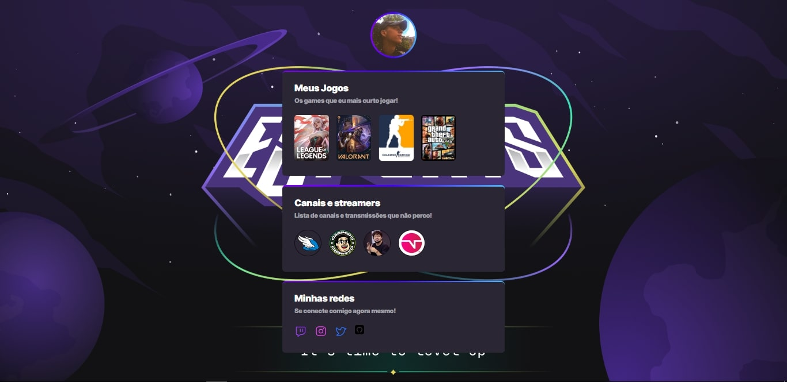

<h1 align="center">🎮Esports Profile🎮</h1>

    

## 🚀 Tecnologias

Esse projeto foi desenvolvido com as seguintes tecnologias:

- HTML e CSS
- Git e Github
- Figma

## 💻 Projeto

Projeto de Esports Profile, você pode selecionar e organizar as categorias dos seus jogos e streamers favoritos. 

- [Acesse o projeto finalizado, online](https://gabrielfreitasc.github.io/esportsprofile/)

## 🖼 Layout

Você pode vizualizar o layout do projeto através [DESSE LINK](). é necessário ter conta no [Figma](https://figma.com) para acessa-lo.

---

Feito com ❤ by Gabriel Freitas - Siga-me no [Linkedin](https://www.linkedin.com/in/gabriel-freitasdev/)
